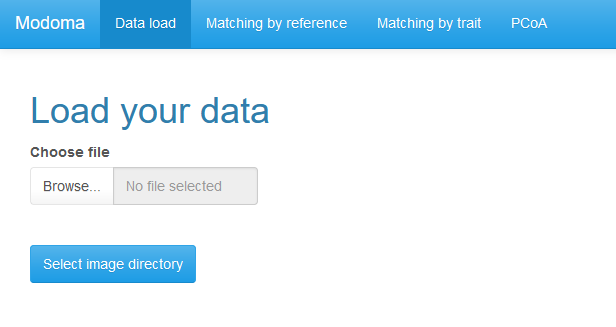
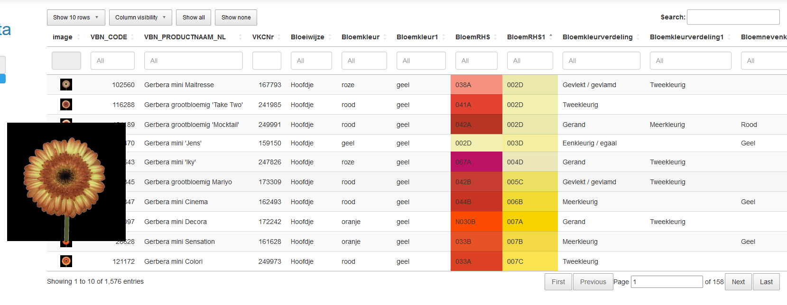
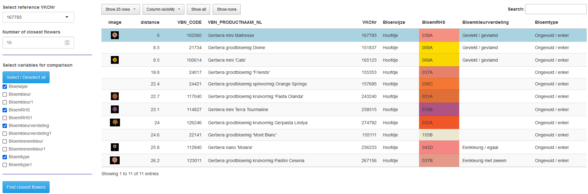
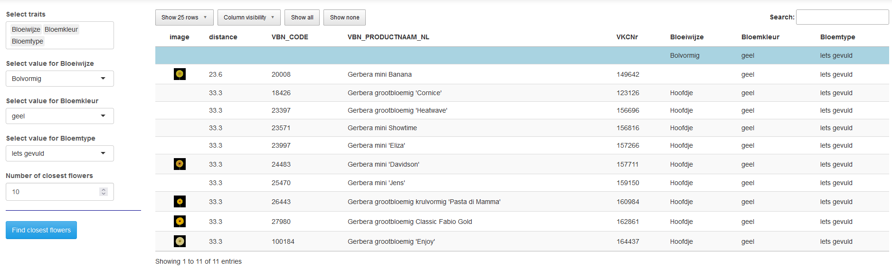

```{r, include = FALSE}
knitr::opts_chunk$set(
  collapse = TRUE,
  comment = "#>"
)
```

In het Modoma project (2021-2023) hebben Floricode, Naktuinbouw en
Biometris/WUR de mogelijkheden onderzocht van automatische identificatie
van bloemkenmerken in rozen en gerbera's, op grond van beelden. Deze
beelden worden door toepassing van AI gelinkt aan de databases waarin de
kenmerken zijn opgeslagen. Om een overzicht te krijgen van de inhoud van
die databases is een app ontwikkeld op basis van R/Shiny. Met deze app
kun je in je browser een overzicht van de kenmerken bekijken, je kunt
records vergelijken, en je kunt een set waardes definieren voor een
subset van de kenmerken, en dan kijken welke records daar het meest op
lijken. Deze versie werkt voor vier datasets: FloricodeGerbera,
FloricodeRose, NaktuinbouwGerbera en NaktuinbouwRose. Het is mogelijk
dit op een relatief eenvoudige manier ook toe te passen op andere
datasets met dezelfde opbouw.

De software draait op alle gangbare besturingssystemen (Windows, MacOS,
Linux). Dit document beschrijft de installatie en het gebruik van de
app.

## Installatie

De installatie van de app kan worden gedaan in een paar eenvoudige
stappen:

1)  Installeer R op je computer. Uitgebreide instructies voor alle
    besturingssystemen zijn te vinden op <https://cran.r-project.org/>.
    Voor Windows komt het er op neer dat je de installatie-executable
    downloadt
    (<https://cran.r-project.org/bin/windows/base/R-4.3.0-win.exe>) en
    installeert door te dubbelklikken - binnen een beschermde omgeving
    kan het zijn dat IT support daarbij moet helpen voor de permissies.

2)  Save het modoma_1.0.0.tar.gz bestand op een plek op je harde schijf,
    in Windows bijvoorbeeld in de nieuwe map "C:/Rsoftware".

3)  Start R op, en type op de command line het volgende:

``` r
install.packages("remotes")
remotes::install_local(path_to_file, dependencies = TRUE)
```

waarbij path_to_file vervangen moet worden door de plek waar het modoma
bestand is opgeslagen, in Windows bijvoorbeeld:

``` r
remotes::install_local("C:/Rsoftware/modoma_1.0.0.tar.gz", dependencies = TRUE)
```

4)  Nu is het modoma pakket beschikbaar. Het kan worden opgeroepen door
    het volgende commando in R te geven:

``` r
library(modoma)
```

5)  Tenslotte wordt de webpagina geopend door het volgende commando:

``` r
launch()
```

## Gebruik van de app

De app bestaat uit een aantal afzonderlijke tabbladen:

-   Data load
-   Matching by reference
-   Matching by trait
-   PCoA

In het vervolg van dit document worden de tabbladen één voor één
besproken.

### Data load

Op het eerste tabblad, "Data load" kunnen de data en de bijbehorende
afbeeldingen worden ingelezen. De ingelezen data vormt de basis voor de
analyses die op de volgende tabbladen kunnen worden uitgevoerd.



1)  Klik op Browse... en selecteer een .csv bestand met de data.

2)  Klik op Select image directory en selecteer de directory waarin de
    afbeeldingen staan opgeslagen.

3)  Nadat zowel de data als de afbeeldingen zijn geselecteerd, wordt een
    tabel gegenereerd waarin de inhoud van het data bestand gekoppeld is
    aan de geselecteerde afbeeldingen. Dit houdt in dat verwijzingen in
    het data bestand naar de bestanden met afbeeldingen in de tabel zijn
    vervangen door de afbeeldingen zelf.

{width="850"}

In de tabel kan op verschillende manieren verder ingezoomd worden op
verschillende aspecten van de data.

-   Door over de afbeeldingen van de bloemen te bewegen met de muis
    wordt een uitvergrote versie van de afbeelding getoond.

-   Standaard worden 10 regels in de tabel getoond. Dit kan worden
    aangepast door linksboven op het menuutje "Show 10 rows" te klikken
    en een ander aantal regels te selecteren.

-   Standaard worden alle kolommen in de tabel getoond. Dit kan worden
    aangepast door in het menu "Column visibility" kolommen te verbergen
    door erop te klikken. Nogmaals klikken op dezelfde kolom zorgt
    ervoor dat deze weer getoond wordt. De twee knoppen ernaast, "Show
    all" en "Show none", geven een snelle manier om alle kolommen weer
    te tonen, danwel om ze juist allemaal te verbergen.

-   In het "Search" vak rechtsboven kan op een willekeurige tekst in de
    tabel gezocht worden. Het zoeken wordt gedaan in alle kolommen van
    de tabel en alleen rijen waarin de zoekterm wordt gevonden, worden
    getoond. Om alle rijen weer te tonen kan het zoekvak worden
    leeggemaakt.

-   Binnen een enkele kolom kan gefilterd worden. Dit kan door in het
    vak onder de kolomnaam waar standaard *All* staat te klikken.
    Afhankelijk van het type kolom verschilt de filtermethode. Voor
    factor kolommen, kolommen waarin de inhoud een beperkte set waarden
    aanneemt, wordt er dan een dropdown menu weergegeven waarin waarden
    kunnen worden geselecteerd. Voor numerieke kolommen een schuifbalk
    waarin onder- en bovengrens voor de waarden in de kolom kunnen
    worden aangegeven. Voor de resterende kolommen kan een willekeurige
    tekst worden getypt waarna alleen rijen waarin in de betreffende
    kolom deze tekst voorkomt worden getoond.

-   De tabel kan worden gesorteerd gebaseerd op de inhoud van een kolom.
    Dat kan door op de pijltjes te klikken die naast de kolomnaam staan.
    Pijltje omhoog voor oplopend sorteren, omlaag voor aflopend
    sorteren.

-   Met de knoppen rechts onderaan de tabel kan worden genavigeerd
    tussen de verschillende pagina's waaruit de tabel bestaat.

### Matching by reference

Op dit tabblad kan voor een gekozen referentie variëteit gezocht worden
naar de variëteiten die de meeste gelijkenis vertonen met deze
variëteit. De vergelijking kan gedaan worden op basis van één of meer in
de data aanwezige kenmerken.

De stappen om de vergelijking te doen zijn als volgt:

1)  Kies de referentie variëteit door in het dropdown menu bij "Select
    reference" de variëteit te selecteren. Het is mogelijk om, in plaats
    van te selecteren met behulp van de muis, het nummer van de
    variëteit in ditzelfde veld te typen. Daarvoor moet wel eerst de
    oorspronkelijke tekst worden verwijderd.

2)  Kies het gewenste aantal variëteiten dat moet worden gezocht.
    Standaard staat dit op 10, wat inhoudt dat er gezocht zal worden
    naar de 10 variëteiten die de meeste gelijkenis vertonen met de
    referentie variëteit. Dit aantal kan worden aangepast door in
    "Number of closest flowers" een ander aantal te typen, of door met
    behulp van de pijltjes het aantal te verhogen of verlagen.

3)  Selecteer de kenmerken die gebruikt moeten worden in de vergelijking
    tussen de variëteiten. Er moet minimaal 1 kenmerk geselecteerd
    worden door het aanvinken van een hokje voor het betreffende kenmerk
    onder "Select variables for comparison". Via "Select / Deselect all"
    kunnen alle kenmerken in één keer geselecteerd danwel gedeselecteerd
    worden.

4)  Klik op "Find closest flowers".

De afstand van de referentie variëteit tot alle andere variëteiten wordt
nu uitgerekend en de variëteiten met de kleinste afstand, ofwel de meest
gelijkende, worden getoond in een tabel die vergelijkbaar is met die op
het voorgaande tabblad. De tabel heeft een extra kolom afstand waarin de
berekende afstand tot de referentie variëteit wordt weergegeven. Deze
variëteit zelf staat ook in de tabel met een lichtblauwe achtergrond.

In de tabel worden naast een aantal standaard kolommen alleen de
kenmerken getoond die zijn meegenomen in de vergelijking. De andere
kenmerken kunnen nog wel zichtbaar worden gemaakt door extra kolommen
zichtbaar te maken in "Column visibility". De kolomzichtbaarheid is
gekoppeld aan die op het eerste tabblad. Kolommen die hier zichtbaar
gemaakt worden, worden dat ook op tabblad één en vice versa.

{width="850"}

### Matching by trait

Op het derde tabblad kan op basis van een aantal geselecteerde kenmerken
en daarbij behorende waarden gezocht worden naar de variëteiten die het
meest overeenkomen met die waarden.

De stappen om tot deze vergelijking te komen zijn als volgt:

1)  Selecteer één of meer kenmerken uit het dropdown menu onder "Select
    traits". Na selectie van de kenmerken wordt voor elk van de
    geselecteerde kenmerken een nieuw selectieveld getoond.

2)  Selecteer in elk van de nieuwe selectievelden in het dropdown menu
    voor dat veld de gewenste waarde voor de variëteiten waarnaar
    gezocht moet worden.

3)  Kies het gewenste aantal variëteiten dat moet worden gezocht.
    Standaard staat dit op 10, wat inhoudt dat er gezocht zal worden
    naar de 10 variëteiten die de meeste gelijkenis vertonen met de
    referentie variëteit. Dit aantal kan worden aangepast door in
    "Number of closest flowers" een ander aantal te typen, of door met
    behulp van de pijltjes het aantal te verhogen of verlagen.

4)  Klik op "Find closest flowers".

Voor alle variëteiten wordt nu de afstand berekend tot de geselecteerde
referentiewaarden. De variëteiten met de kleinste afstand tot de
referentiewaarden, ofwel de best op de waarden gelijkenden, worden
getoond in een tabel. Deze tabel heeft exact dezelfde eigenschappen als
die op het tweede tabblad, voor een uitgebreidere omschrijving zie die
sectie.

Ook de zichtbare kolommen in deze tabel zijn nu gekoppeld met die op de
eerdere tabbladen. Verbergen of zichtbaar maken van kolommen op het ene
tabblad zal hetzelfde doen op de andere twee tabbladen.

{width="850"}

### PCoA

Op het laatste tabblad kan een **P**rincipal **Co**ordinate **A**nalysis
worden uitgevoerd. De resultaten hiervan worden gevisualiseerd en kunnen
daarna gekleurd worden op basis van een kenmerk uit de data.

De stappen om een PCoA uit te voeren zijn als volgt:

1)  Selecteer de kenmerken die gebruikt moeten worden in de PCoA. Er
    moet minimaal 1 kenmerk geselecteerd worden door het aanvinken van
    een hokje voor het betreffende kenmerk onder "Select variables for
    PCoA". Via "Select / Deselect all" kunnen alle kenmerken in één keer
    geselecteerd danwel gedeselecteerd worden.

2)  Kies bij "Select variable for coloring" een kenmerk volgens welk de
    resultaten in de output gekleurd moeten worden.

3)  Klik op "Perform PCoA".

Er wordt nu een PCoA uitgevoerd en de resultaten hiervan worden
gevisualiseerd in een biplot met op de x-as PC1 en op de y-as PC2. De
punten in de plot worden gekleurd volgens het kenmerk gekozen bij 2).

-   De kleuring in de grafiek kan worden aangepast door bij "Select
    variable for coloring" een nieuw kenmerk te kiezen. Het is niet
    nodig dan de analyse opnieuw uit te voeren.

-   Door in de plot met de muis over punten heen te bewegen worden de
    afbeelding en het nummer van de variëteit getoond.

-   In het plaatje kan ingezoomd worden door met de linkermuisknop
    ingedrukt een rechthoek te tekenen. Na het loslaten van de
    linkermuisknop worden de assen in het plaatje aangepast zodat ze
    samenvallen met de geselecteerde rechthoek. Om weer uit te zoomen
    moet ergens in de grafiek twee keer snel achter elkaar geklikt
    worden.

-   Door in de legenda op een waarde te klikken wordt die waarde niet
    langer weergegeven in het plaatje. Door opnieuw op de waarde te
    klikken worden de betreffende punten weer zichtbaar. Door twee keer
    snel achter elkaar op een waarde te klikken wordt die waarde
    geïsoleerd, alleen punten voor die waarde zijn nog zichtbaar in het
    plaatje. Nogmaals twee keer klikken zorgt ervoor dat alle punten
    weer zichtbaar worden.

-   Het plaatje kan opgeslagen worden als .png bestand door op het
    camera symbooltje rechtsbovenin de grafiek te klikken.

## Technische details

### Gebruikte afstandsmaten

Het onderliggende R-pakket met de naam modoma definieert welke
afstandsmaten gebruikt worden voor welke variabelen. Voor numerieke
variabelen wordt de gewone Euclidische afstand gebruikt. Andere typen
variabelen worden, wanneer dat kan, ook omgezet naar getallen, waarna de
Euclidische afstand gebruikt kan worden. Dit geldt voor kleuren die door
specifieke codes (bijvoorbeeld RHS codes) zijn aangegeven, maar ook voor
geordende factoren (bv. klein, middel, groot). Tenslotte wordt voor
niet-geordende factoren (categorische variabelen, zoals kleurnamen) een
Tanimoto-afstandsmaat gebruikt, waarbij de afstand alleen dan nul is als
beide records exact dezelfde waarde bevatten voor die variabele, en
anders gelijk is aan 1.

Wanneer op deze voor iedere variabele dan een afstandsmatrix is
berekend, worden deze matrices gecombineerd tot een algemene
afstandsmaat. Om te voorkomen dat een of enkele variabelen de overall
afstandsmaat gaan domineren, bijvoorbeeld door de schaal waarop de
variabele is weergegeven, worden alle afstanden eerst geschaald (waarbij
de kleinste afstand op nul gezet wordt, en de grootste op een).
Vervolgens worden de afstanden bij elkaar opgeteld. Onder de motorkap
zijn al voorbereidingen getroffen om het mogelijk te maken gewichten toe
te kennen aan specifieke variabelen, waardoor men bepaalde
karakteristieken extra kan benadrukken. In de huidige versie van de
gebruikersinterface is dat nog niet geimplementeerd.
